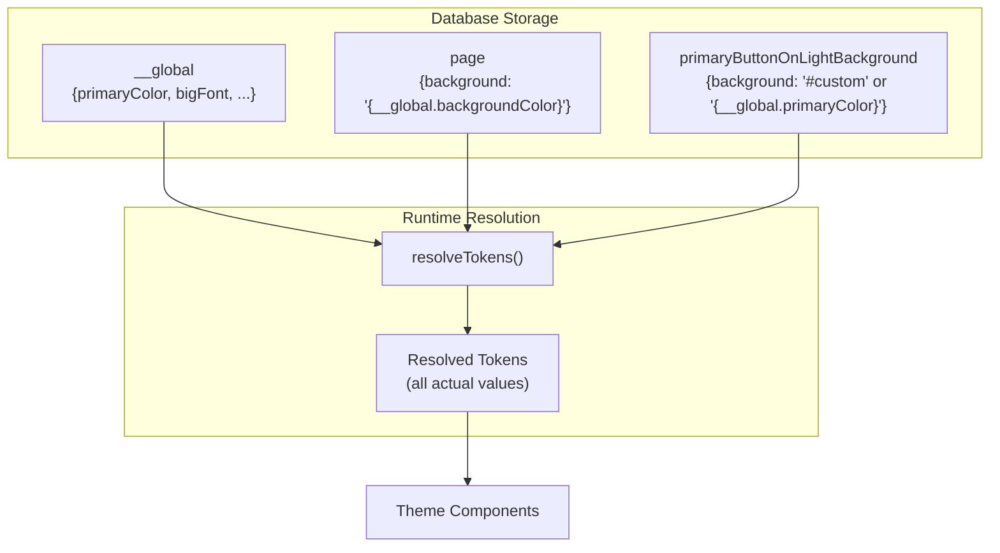

# Design Token Reference System

## Architecture




## Key Files

- [`apps/webapp/src/database/types.ts`](apps/webapp/src/database/types.ts) - Token type definitions
- [`apps/webapp/src/lib/wedding/tokens.ts`](apps/webapp/src/lib/wedding/tokens.ts) - New file for token utilities
- [`apps/webapp/src/stores/websiteBuilderStore.ts`](apps/webapp/src/stores/websiteBuilderStore.ts) - Store updates for token management

## Implementation

### 1. Define Token Types with Reference Support

Update the `WebsiteTokens` type to support both direct values and references:

```typescript
type TokenReference = `{__global.${keyof GlobalTokens}}`;
type TokenValueOrRef = string; // Either "#hex" or "{__global.key}"

export type GlobalTokens = {
  primaryColor: string;
  bigFont: string;
  defaultFont: string;
  backgroundColor: string;
  headingColor: string;
  bodyColor: string;
};

export type WebsiteTokens = {
  __global: GlobalTokens;
  page: {
    background: TokenValueOrRef;
    fontFamily: TokenValueOrRef;
  };
  primaryButtonOnLightBackground: {
    background: TokenValueOrRef;
    color: TokenValueOrRef;
    fontFamily: TokenValueOrRef;
  };
  // ... other component tokens
};
```


### 2. Create Token Utilities

New file with helpers for:

- `isTokenReference(value)` - Check if value is a reference string
- `resolveTokenValue(value, globals)` - Resolve a single reference to actual value
- `resolveTokens(tokens)` - Resolve entire token object to flat values for rendering
- `createDefaultTokens(globals)` - Generate default tokens with all references pointing to globals
- `updateGlobalToken(tokens, key, value)` - Update global and cascade to non-overridden values
- `updateComponentToken(tokens, path, value)` - Set a component token (marks as override)
- `resetComponentToken(tokens, path)` - Reset component token back to reference

### 3. Default Token Factory

```typescript
export const createDefaultTokens = (globals: GlobalTokens): WebsiteTokens => ({
  __global: globals,
  page: {
    background: "{__global.backgroundColor}",
    fontFamily: "{__global.defaultFont}",
  },
  primaryButtonOnLightBackground: {
    background: "{__global.primaryColor}",
    color: "{__global.backgroundColor}",
    fontFamily: "{__global.defaultFont}",
  },
  // ... all component tokens reference globals by default
});
```


### 4. Store Integration

Update the website builder store to:

- Track which tokens are overridden vs inherited
- Provide `updateGlobalToken()` that cascades to non-overridden values
- Provide `updateComponentToken()` that marks as override
- Provide `resetToGlobal()` to convert override back to reference

## Cascade Behavior

When user updates a global (e.g., `primaryColor`):

1. Update `__global.primaryColor`
2. Scan all component tokens for references like `"{__global.primaryColor}"`
3. These auto-resolve to new value at render time
4. Tokens with explicit values (overrides) remain unchanged

When user updates a component token:

1. Store the actual value (not a reference)