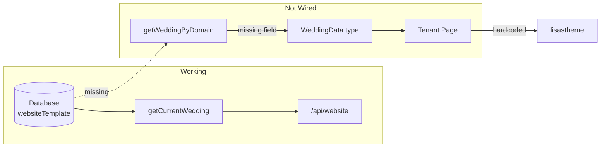

# Dynamic Theme Selection

The `websiteTemplate` database field exists but isn't fully wired. The tenant page currently hardcodes `"lisastheme"` instead of reading from the database.

## Current State

## Changes Required

### 1. Add `websiteTemplate` to `WeddingData` type

[apps/webapp/src/lib/wedding/types.ts](apps/webapp/src/lib/wedding/types.ts) - Add the field to the type definition

### 2. Add `websiteTemplate` to `getWeddingByDomain()` query  

[apps/webapp/src/lib/wedding/getWeddingByDomain.ts](apps/webapp/src/lib/wedding/getWeddingByDomain.ts) - Include `websiteTemplate: wedding.websiteTemplate` in the select

### 3. Update tenant page to use dynamic theme

[apps/webapp/src/app/(tenant)/tenant/[domain]/page.tsx](apps/webapp/src/app/(tenant)/tenant/[domain]/page.tsx) - Change hardcoded `"lisastheme"` to `weddingData.websiteTemplate ?? "lisastheme"`

### 4. Add `websiteTemplate` to the website-builder PATCH schema

[apps/webapp/src/app/api/website-builder/route.ts](apps/webapp/src/app/api/website-builder/route.ts) - Extend `patchBodySchema` to accept `websiteTemplate` and update the DB

### 5. Create theme selector in templates page (for authenticated users)

[apps/webapp/src/components/application/templates/TemplatesGrid.tsx](apps/webapp/src/components/application/templates/TemplatesGrid.tsx) - Add selection functionality that calls the API when a user picks a theme

## Implementation Notes

- `ThemeId` type already exists: `"lisastheme" | "tuscanbloom"`